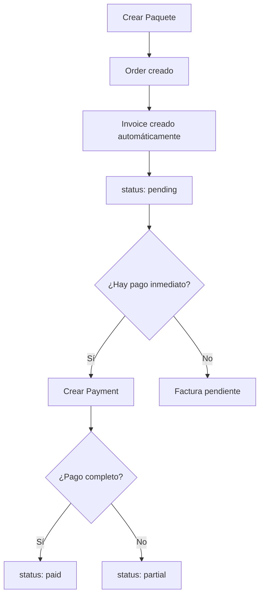
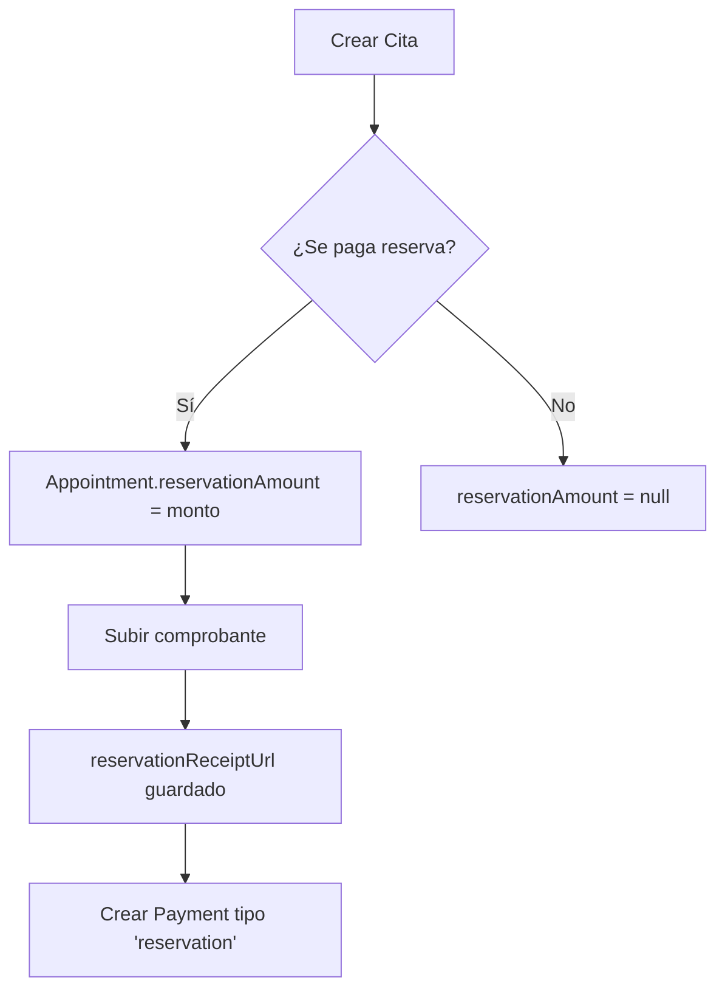

# 🏥 DermicaPro - Sistema de Pagos Completo
## Especificación Técnica & UX/UI Design

**Autor**: Senior Developer - Payment Systems Expert
**Fecha**: 2025-12-05
**Versión**: 1.0

---

## 📋 Tabla de Contenidos

1. [Arquitectura del Sistema de Pagos](#arquitectura)
2. [Modelos de Datos](#modelos-de-datos)
3. [Flujos de Pago](#flujos-de-pago)
4. [Casos de Uso](#casos-de-uso)
5. [Estados y Transiciones](#estados-y-transiciones)
6. [Diseño UX/UI](#diseño-ux-ui)
7. [Vistas Propuestas](#vistas-propuestas)
8. [Reglas de Negocio](#reglas-de-negocio)

---

## 🏗️ Arquitectura del Sistema de Pagos

### Jerarquía de Conceptos

```
Patient (Paciente)
  └─ Order (Paquete de Servicio contratado)
      ├─ Invoice (Factura por el paquete) [1:1]
      │   └─ Payment[] (Pagos aplicados a la factura) [1:N]
      └─ AppointmentService[] (Sesiones del paquete) [1:N]
           └─ Appointment (Cita donde se realiza la sesión)
                └─ Payment[] (Pagos de reserva de cita) [1:N]
```

### Dualidad de Pagos

El sistema tiene **DOS tipos de pagos independientes**:

#### 1️⃣ **Pagos de Paquete** (Order → Invoice → Payment)
- **Qué es**: Pago del servicio completo (todas las sesiones)
- **Cuándo**: Puede pagarse antes, durante o después del tratamiento
- **Modelo**: Invoice con múltiples Payments
- **Estados**: pending → partial → paid
- **Ejemplo**: Paquete de 10 sesiones de depilación láser por S/. 1,500

#### 2️⃣ **Pagos de Reserva** (Appointment.reservationAmount)
- **Qué es**: Adelanto/señal para confirmar la cita
- **Cuándo**: Al momento de reservar la cita
- **Modelo**: Campo directo en Appointment
- **Estados**: null (sin reserva) | número (monto pagado)
- **Ejemplo**: Adelanto de S/. 100 para asegurar la cita

---

## 📊 Modelos de Datos

### Order (Paquete)

```typescript
interface Order {
  id: string
  patientId: string              // Paciente que contrató
  serviceId: string              // Servicio (ej: Depilación Láser)
  totalSessions: number          // Total de sesiones (ej: 10)
  completedSessions: number      // Sesiones completadas (ej: 3)
  originalPrice: Decimal         // Precio sin descuento
  discount: Decimal              // Descuento aplicado
  finalPrice: Decimal            // Precio final a pagar
  notes?: string
  createdAt: DateTime

  // Relations
  service: Service
  invoice?: Invoice              // UNA factura por order
  appointmentServices: AppointmentService[]  // Sesiones
}
```

**Reglas**:
- Un Order representa un paquete completo contratado
- `finalPrice` es el monto total a cobrar
- `completedSessions` se actualiza cuando una sesión es marcada como "attended"

### Invoice (Factura)

```typescript
interface Invoice {
  id: string
  orderId: string (unique)       // Un Invoice por Order
  patientId: string
  totalAmount: Decimal           // = Order.finalPrice
  status: InvoiceStatus          // pending | partial | paid | cancelled
  dueDate?: DateTime
  createdAt: DateTime
  updatedAt: DateTime

  // Relations
  order: Order
  payments: Payment[]            // Múltiples pagos
}
```

**Reglas**:
- Se crea automáticamente al crear un Order
- `totalAmount` debe ser igual a `Order.finalPrice`
- `status` se actualiza basado en la suma de payments

**Cálculo de status**:
```typescript
const totalPaid = payments.reduce((sum, p) => sum + p.amountPaid, 0)

if (totalPaid === 0) status = 'pending'
else if (totalPaid < totalAmount) status = 'partial'
else if (totalPaid >= totalAmount) status = 'paid'
```

### Payment (Pago)

```typescript
interface Payment {
  id: string
  patientId: string
  invoiceId?: string             // Si es pago de factura
  appointmentId?: string         // Si es pago de reserva
  amountPaid: Decimal            // Monto pagado
  paymentMethod: PaymentMethod   // cash | card | transfer | yape | plin
  paymentType: PaymentType       // Ver tipos abajo
  paymentDate: DateTime
  receiptUrl?: string            // Comprobante
  notes?: string
  createdById: string            // Usuario que registró
  createdAt: DateTime
}
```

**PaymentType (Tipos de pago)**:
```typescript
enum PaymentType {
  invoice_payment = 'invoice_payment',    // Pago de factura (tiene invoiceId)
  reservation = 'reservation',            // Adelanto de cita (tiene appointmentId)
  service_payment = 'service_payment',    // Pago directo de servicio
  account_credit = 'account_credit',      // Abono a cuenta
  penalty = 'penalty',                    // Multa
  other = 'other'                         // Otro
}
```

**Reglas**:
- Debe tener `invoiceId` XOR `appointmentId` (excluyentes)
- Si `paymentType = 'invoice_payment'`, debe tener `invoiceId`
- Si `paymentType = 'reservation'`, debe tener `appointmentId`
- `amountPaid` debe ser > 0

### Appointment (Cita)

```typescript
interface Appointment {
  id: string
  patientId: string
  scheduledDate: DateTime
  status: AppointmentStatus
  reservationAmount?: Decimal    // Adelanto de reserva
  reservationReceiptUrl?: string // Comprobante de reserva
  notes?: string

  // Relations
  appointmentServices: AppointmentService[]
  payments: Payment[]            // Pagos de reserva
}
```

**Reglas**:
- `reservationAmount` es OPCIONAL e independiente del Invoice
- `reservationReceiptUrl` se registra cuando se sube el comprobante
- Los pagos de tipo "reservation" se vinculan aquí

---

## 🔄 Flujos de Pago

### Flujo 1: Creación de Order con Invoice



### Flujo 2: Pagos Parciales

```
Estado inicial: Invoice.status = 'pending', totalAmount = 1000

1. Payment 1: amountPaid = 300
   → totalPaid = 300
   → status = 'partial' (300 < 1000)

2. Payment 2: amountPaid = 500
   → totalPaid = 800
   → status = 'partial' (800 < 1000)

3. Payment 3: amountPaid = 200
   → totalPaid = 1000
   → status = 'paid' (1000 >= 1000)
```

### Flujo 3: Reserva de Cita



---

## 🎯 Casos de Uso

### Caso 1: Paciente Nuevo - Pago Completo Adelantado

**Escenario**: Cliente nuevo quiere pagar todo el paquete antes de empezar

1. ✅ Crear Patient
2. ✅ Crear Order (10 sesiones, finalPrice = 1500)
3. ✅ Invoice creado automáticamente (status: pending)
4. ✅ Registrar Payment (1500, invoice_payment)
5. ✅ Invoice.status → 'paid'
6. ✅ Crear Appointments según disponibilidad

**Vista UI**:
- ✅ Badge verde "PAGADO COMPLETO"
- ✅ No mostrar botones de pago
- ✅ Mostrar recibo de pago

### Caso 2: Paciente Nuevo - Pago por Sesión

**Escenario**: Cliente prefiere pagar sesión por sesión

1. ✅ Crear Patient
2. ✅ Crear Order (10 sesiones, finalPrice = 1500)
3. ✅ Invoice creado (status: pending)
4. ✅ Crear primera Appointment con reserva (reservationAmount = 150)
5. ✅ Al atender, registrar Payment (150, service_payment)
6. ✅ Invoice.status → 'partial'
7. 🔁 Repetir por cada sesión

**Vista UI**:
- ⚠️ Badge amarillo "PAGO PARCIAL (S/. 150/1500)"
- 🔴 Badge rojo "PENDIENTE: S/. 1350"
- 💳 Botón "Registrar Pago"
- 📊 Barra de progreso de pago

### Caso 3: Paciente con Reserva + Pago Posterior

**Escenario**: Cliente paga reserva ahora, paquete después

1. ✅ Crear Appointment con reserva (reservationAmount = 100)
2. ✅ Subir comprobante de reserva
3. ✅ Crear Payment (100, reservation, appointmentId)
4. ⏳ **IMPORTANTE**: La reserva NO descuenta del Invoice
5. ✅ Luego crear Payment del paquete cuando pague

**Vista UI**:
- 💚 "Reserva pagada: S/. 100" (separado)
- 🔴 "Paquete pendiente: S/. 1500" (independiente)
- 📝 Claridad de que son pagos distintos

### Caso 4: Múltiples Paquetes del Mismo Paciente

**Escenario**: Paciente tiene 2 paquetes diferentes

```
Order 1: Depilación Láser (10 sesiones) - S/. 1500
  └─ Invoice 1: pending (S/. 500/1500 pagados)

Order 2: Tratamiento Facial (6 sesiones) - S/. 900
  └─ Invoice 2: paid (S/. 900/900 pagados)

Appointment 1: 2 sesiones (1 de cada paquete)
  └─ reservationAmount: 50
```

**Vista UI**:
- 📦 Agrupación por paquete
- 💰 Estado de pago independiente por paquete
- 🎯 Total de la cita = suma de todos los paquetes
- ⚠️ Badge "PAGO PENDIENTE" si algún paquete está pendiente

---

## 📍 Estados y Transiciones

### Estados de Invoice

```
┌─────────┐
│ pending │ ◄─── Inicial (0% pagado)
└────┬────┘
     │ Pago parcial
     ▼
┌─────────┐
│ partial │ ◄─── 0% < pagado < 100%
└────┬────┘
     │ Pago completo
     ▼
┌─────────┐
│  paid   │ ◄─── 100% pagado
└─────────┘
     ▲
     │ Puede cancelarse
     │
┌───────────┐
│ cancelled │
└───────────┘
```

### Relación Invoice ↔ Appointment

**❌ NO HAY RELACIÓN DIRECTA**

- Invoice pertenece a Order
- Appointment tiene AppointmentService que apuntan a Order
- El pago del Invoice NO depende del estado de las citas
- Las citas pueden estar "reserved", "attended", etc. independientemente del pago

**Implicaciones UX**:
```
✅ Puede tener citas attended pero Invoice pending
✅ Puede pagar todo antes de tener citas
✅ Puede cancelar citas pero mantener pago del paquete
```

---

## 🎨 Diseño UX/UI

### Principios de Diseño

1. **Transparencia**: El paciente siempre debe saber cuánto debe y cuánto ha pagado
2. **Separación clara**: Reservas y pagos de paquete son conceptos distintos
3. **Visual hierarchy**: Estados críticos (deuda) deben ser prominentes
4. **Acciones claras**: Botones de pago siempre visibles cuando hay deuda
5. **Historia completa**: Mostrar todos los pagos realizados

### Paleta de Colores para Estados

```css
/* Invoice Status Colors */
.invoice-pending {
  background: linear-gradient(135deg, #fef3c7 0%, #fde68a 100%);
  color: #78350f;
  border: 2px solid #f59e0b;
}

.invoice-partial {
  background: linear-gradient(135deg, #fed7aa 0%, #fdba74 100%);
  color: #7c2d12;
  border: 2px solid #f97316;
}

.invoice-paid {
  background: linear-gradient(135deg, #d1fae5 0%, #a7f3d0 100%);
  color: #065f46;
  border: 2px solid #10b981;
}

.invoice-cancelled {
  background: linear-gradient(135deg, #fecaca 0%, #fca5a5 100%);
  color: #7f1d1d;
  border: 2px solid #ef4444;
}

/* Payment Urgency */
.payment-urgent {
  animation: pulse 2s ease-in-out infinite;
  box-shadow: 0 0 0 4px rgba(239, 68, 68, 0.2);
}

.payment-warning {
  border: 2px solid #f59e0b;
}
```

---

## 📱 Vistas Propuestas

### Vista 1: Detalle de Cita (Appointment Detail) - MEJORADA

**Ubicación**: `/appointments/:id`

**Secciones**:

#### 1.1 Header de Cita
```
┌─────────────────────────────────────────────────┐
│ ← Volver a Citas                                │
│                                                 │
│ Detalle de Cita                                 │
│ 🟢 Atendida         [Editar] [Opciones]        │
└─────────────────────────────────────────────────┘
```

#### 1.2 Información Básica
```
┌─────────────────────────────────────────────────┐
│ 📅 Información de la Cita                       │
├─────────────────────────────────────────────────┤
│ Fecha: Lunes, 4 de diciembre de 2025           │
│ Hora: 10:00 AM                                  │
│ Paciente: María García                          │
│ Duración: 60 minutos                            │
└─────────────────────────────────────────────────┘
```

#### 1.3 Paquetes de esta Cita (CON PRECIOS)
```
┌─────────────────────────────────────────────────┐
│ 📦 Servicios de esta Cita                       │
├─────────────────────────────────────────────────┤
│                                                 │
│ ┌─ Depilación Láser Facial  [S/. 1,500.00]   │
│ │  📦 Paquete Existente                        │
│ │  ✓ 3 atendidas  ● 2 de 10  📅 01/11/2025   │
│ │                                               │
│ │  Sesión 4 de 10                              │
│ │  Sesión 5 de 10                              │
│ └─                                              │
│                                                 │
│ ┌─ Tratamiento Facial  [S/. 900.00]           │
│ │  📦 Paquete Existente                        │
│ │  ✓ 1 atendida  ● 1 de 6  📅 15/11/2025     │
│ │                                               │
│ │  Sesión 2 de 6                               │
│ └─                                              │
│                                                 │
│ Total de Servicios: S/. 2,400.00               │
└─────────────────────────────────────────────────┘
```

#### 1.4 Estado de Pago - DISEÑO COMPLETO
```
┌─────────────────────────────────────────────────┐
│ 💳 Estado de Pago                               │
├─────────────────────────────────────────────────┤
│                                                 │
│ ┌─ PAQUETE 1: Depilación Láser Facial ────────┐│
│ │  Total del Paquete: S/. 1,500.00            ││
│ │  ✅ Pagado: S/. 500.00 (33%)                ││
│ │  ⚠️ Pendiente: S/. 1,000.00                 ││
│ │                                              ││
│ │  Historial de Pagos:                         ││
│ │  • 01/11/2025 - S/. 300.00 (Yape)           ││
│ │  • 15/11/2025 - S/. 200.00 (Efectivo)       ││
│ │                                              ││
│ │  [💰 Registrar Pago]  [📄 Ver Factura]     ││
│ └──────────────────────────────────────────────┘│
│                                                 │
│ ┌─ PAQUETE 2: Tratamiento Facial ─────────────┐│
│ │  Total del Paquete: S/. 900.00              ││
│ │  ✅ PAGADO COMPLETO                         ││
│ │                                              ││
│ │  Historial de Pagos:                         ││
│ │  • 15/11/2025 - S/. 900.00 (Transferencia)  ││
│ │                                              ││
│ │  [📄 Ver Factura]  [🖨️ Imprimir]           ││
│ └──────────────────────────────────────────────┘│
│                                                 │
│ ┌─ RESERVA DE ESTA CITA ───────────────────────┐│
│ │  Adelanto Pagado: S/. 100.00                ││
│ │  📸 Comprobante subido                       ││
│ │  [Ver Recibo]                                ││
│ └──────────────────────────────────────────────┘│
│                                                 │
│ 🎯 RESUMEN DE ESTA CITA:                        │
│ • Paquetes: S/. 2,400.00                        │
│ • Pagado: S/. 1,400.00 (58%)                    │
│ • Pendiente: S/. 1,000.00                       │
│ • Reserva (independiente): S/. 100.00           │
│                                                 │
│ [💰 Registrar Pago del Paquete]                 │
└─────────────────────────────────────────────────┘
```

---

### Vista 2: Facturas del Paciente (NUEVA)

**Ubicación**: `/patients/:id/invoices`

```
┌─────────────────────────────────────────────────┐
│ ← Volver a Paciente                             │
│                                                 │
│ 💳 Facturas y Pagos - María García             │
│                                                 │
│ [Filtros: Todas ▼] [Estado: Todos ▼] [Buscar] │
└─────────────────────────────────────────────────┘

┌─────────────────────────────────────────────────┐
│ 📊 Resumen Financiero                           │
├─────────────────────────────────────────────────┤
│                                                 │
│  💰 Total Contratado:    S/. 5,400.00          │
│  ✅ Total Pagado:        S/. 2,900.00 (54%)    │
│  ⚠️ Total Pendiente:     S/. 2,500.00          │
│                                                 │
│  📈 Progreso: ████████░░░░░░ 54%               │
│                                                 │
│  [💳 Registrar Pago Global]  [📄 Ver Todo]     │
└─────────────────────────────────────────────────┘

┌─────────────────────────────────────────────────┐
│ 📋 Paquetes Activos                             │
├─────────────────────────────────────────────────┤
│                                                 │
│ ┌─ Factura #INV-001 ──────────────────────────┐ │
│ │  Depilación Láser Facial                    │ │
│ │  📦 Paquete de 10 sesiones                  │ │
│ │  ✓ 3 completadas  ● 2 reservadas            │ │
│ │                                             │ │
│ │  Estado: ⚠️ PAGO PARCIAL                    │ │
│ │  Total: S/. 1,500.00                        │ │
│ │  Pagado: S/. 500.00 (33%)                   │ │
│ │  Pendiente: S/. 1,000.00                    │ │
│ │                                             │ │
│ │  Fecha de creación: 01/11/2025              │ │
│ │  Vencimiento: 01/02/2026                    │ │
│ │                                             │ │
│ │  [💰 Pagar]  [📄 Ver Detalle] [📜 Historial]│ │
│ └─────────────────────────────────────────────┘ │
│                                                 │
│ ┌─ Factura #INV-002 ──────────────────────────┐ │
│ │  Tratamiento Facial                         │ │
│ │  📦 Paquete de 6 sesiones                   │ │
│ │  ✓ 1 completada  ● 1 reservada              │ │
│ │                                             │ │
│ │  Estado: ✅ PAGADO COMPLETO                 │ │
│ │  Total: S/. 900.00                          │ │
│ │  Pagado: S/. 900.00 (100%)                  │ │
│ │                                             │ │
│ │  Fecha de creación: 15/11/2025              │ │
│ │  Pagado completamente: 15/11/2025           │ │
│ │                                             │ │
│ │  [✓ Pagado]  [📄 Ver Detalle]  [🖨️ Imprimir]│ │
│ └─────────────────────────────────────────────┘ │
└─────────────────────────────────────────────────┘

┌─────────────────────────────────────────────────┐
│ 📜 Historial de Pagos (Todos)                   │
├─────────────────────────────────────────────────┤
│                                                 │
│ 15/11/2025  💳 Transferencia   S/. 900.00       │
│ Paquete: Tratamiento Facial                     │
│ Estado: Procesado ✓                             │
│ Recibo: [Ver] 📸                                │
│ ─────────────────────────────────────────────── │
│                                                 │
│ 15/11/2025  💵 Efectivo        S/. 200.00       │
│ Paquete: Depilación Láser                       │
│ Estado: Procesado ✓                             │
│ ─────────────────────────────────────────────── │
│                                                 │
│ 01/11/2025  📱 Yape            S/. 300.00       │
│ Paquete: Depilación Láser                       │
│ Estado: Procesado ✓                             │
│ Recibo: [Ver] 📸                                │
│ ─────────────────────────────────────────────── │
│                                                 │
│ 01/11/2025  💵 Reserva         S/. 100.00       │
│ Cita: 04/12/2025 10:00 AM                       │
│ Estado: Procesado ✓                             │
│ Tipo: Adelanto de reserva                       │
│ Recibo: [Ver] 📸                                │
│                                                 │
└─────────────────────────────────────────────────┘
```

---

### Vista 3: Modal "Registrar Pago"

```
┌─────────────────────────────────────────────────┐
│ 💰 Registrar Pago                          [✕]  │
├─────────────────────────────────────────────────┤
│                                                 │
│ Paquete: Depilación Láser Facial                │
│ Total del paquete: S/. 1,500.00                 │
│ Ya pagado: S/. 500.00                           │
│ Pendiente: S/. 1,000.00                         │
│                                                 │
│ ─────────────────────────────────────────────── │
│                                                 │
│ Monto a Pagar *                                 │
│ ┌─────────────────────────────────────────────┐ │
│ │ S/. [         ]                             │ │
│ └─────────────────────────────────────────────┘ │
│ Atajos: [S/. 500] [S/. 1,000] [Pagar Todo]      │
│                                                 │
│ Método de Pago *                                │
│ ┌─────────────────────────────────────────────┐ │
│ │ ☑ Efectivo                                  │ │
│ │ ☐ Tarjeta                                   │ │
│ │ ☐ Transferencia                             │ │
│ │ ☐ Yape                                      │ │
│ │ ☐ Plin                                      │ │
│ └─────────────────────────────────────────────┘ │
│                                                 │
│ Comprobante (Opcional)                          │
│ ┌─────────────────────────────────────────────┐ │
│ │ [📤 Subir Imagen]                           │ │
│ └─────────────────────────────────────────────┘ │
│                                                 │
│ Notas (Opcional)                                │
│ ┌─────────────────────────────────────────────┐ │
│ │                                             │ │
│ └─────────────────────────────────────────────┘ │
│                                                 │
│ ─────────────────────────────────────────────── │
│                                                 │
│ Vista Previa:                                   │
│ • Después de este pago: S/. 1,500.00 pagados    │
│ • Estado resultante: ✅ PAGADO COMPLETO         │
│                                                 │
│     [Cancelar]          [💳 Registrar Pago]     │
│                                                 │
└─────────────────────────────────────────────────┘
```

---

## 📐 Reglas de Negocio

### R1: Creación de Invoice

```typescript
// Al crear un Order, crear Invoice automáticamente
async function createOrder(orderData) {
  const order = await prisma.order.create({ data: orderData })

  const invoice = await prisma.invoice.create({
    data: {
      orderId: order.id,
      patientId: order.patientId,
      totalAmount: order.finalPrice, // ⚠️ Debe ser igual
      status: 'pending',
      dueDate: calculateDueDate(order.createdAt) // +90 días
    }
  })

  return { order, invoice }
}
```

### R2: Actualización de Invoice Status

```typescript
// Después de cada Payment, recalcular status
async function createPayment(paymentData) {
  const payment = await prisma.payment.create({ data: paymentData })

  if (payment.invoiceId) {
    await updateInvoiceStatus(payment.invoiceId)
  }

  return payment
}

async function updateInvoiceStatus(invoiceId: string) {
  const invoice = await prisma.invoice.findUnique({
    where: { id: invoiceId },
    include: { payments: true }
  })

  const totalPaid = invoice.payments.reduce(
    (sum, p) => sum + Number(p.amountPaid),
    0
  )

  let newStatus: InvoiceStatus
  if (totalPaid === 0) {
    newStatus = 'pending'
  } else if (totalPaid < Number(invoice.totalAmount)) {
    newStatus = 'partial'
  } else {
    newStatus = 'paid'
  }

  await prisma.invoice.update({
    where: { id: invoiceId },
    data: { status: newStatus }
  })
}
```

### R3: Validación de Pagos

```typescript
// No se puede pagar más del total
async function validatePayment(invoiceId: string, amountToPay: number) {
  const invoice = await getInvoiceWithPayments(invoiceId)

  const totalPaid = invoice.payments.reduce(
    (sum, p) => sum + Number(p.amountPaid),
    0
  )

  const remaining = Number(invoice.totalAmount) - totalPaid

  if (amountToPay > remaining) {
    throw new Error(
      `El monto excede el pendiente. Máximo: S/. ${remaining.toFixed(2)}`
    )
  }

  return true
}
```

### R4: Reserva NO descuenta del Invoice

```typescript
// Los pagos de reserva son independientes
// NO restan del Invoice.totalAmount

const appointment = {
  reservationAmount: 100, // ← NO descuenta del paquete
  appointmentServices: [...] // ← Vinculados a Orders
}

const order = {
  finalPrice: 1500, // ← Total a pagar del paquete
  invoice: {
    totalAmount: 1500, // ← Igual al finalPrice
    // ❌ NO se resta reservationAmount
  }
}
```

### R5: Cálculo de Total de Cita

```typescript
// En AppointmentDetailPage
function calculateAppointmentTotal(appointment: Appointment) {
  // Sumar finalPrice de cada Order único
  const uniqueOrderIds = new Set<string>()
  let packagesTotal = 0

  appointment.appointmentServices.forEach(appSvc => {
    if (appSvc.orderId && !uniqueOrderIds.has(appSvc.orderId)) {
      uniqueOrderIds.add(appSvc.orderId)
      packagesTotal += Number(appSvc.order.finalPrice)
    }
  })

  const reservationPaid = Number(appointment.reservationAmount || 0)

  return {
    packagesTotal,      // Total de paquetes (Orders)
    reservationPaid,    // Adelanto de reserva (independiente)
    // ⚠️ NO se suman, son conceptos separados
  }
}
```

---

## 🚀 Plan de Implementación

### Fase 1: Backend - Endpoints de Pagos
1. ✅ Ya existe: Modelos en Prisma
2. ⬜ Crear: `POST /api/invoices/:id/payments` - Registrar pago
3. ⬜ Crear: `GET /api/patients/:id/invoices` - Listar facturas del paciente
4. ⬜ Crear: `GET /api/invoices/:id` - Detalle de factura con pagos
5. ⬜ Crear: Hook para actualizar Invoice.status automáticamente

### Fase 2: Frontend - Servicios
1. ⬜ Crear: `src/services/invoices.service.ts`
2. ⬜ Crear: `src/services/payments.service.ts`
3. ⬜ Actualizar: `src/types/index.ts` (ya existe)

### Fase 3: Frontend - Componentes
1. ⬜ Crear: `src/components/PaymentStatusCard.tsx` - Card de estado de pago
2. ⬜ Crear: `src/components/RegisterPaymentModal.tsx` - Modal para registrar pago
3. ⬜ Crear: `src/components/PaymentHistory.tsx` - Historial de pagos
4. ⬜ Crear: `src/components/InvoiceCard.tsx` - Card de factura

### Fase 4: Frontend - Páginas
1. ⬜ Crear: `src/pages/PatientInvoicesPage.tsx` - Vista de facturas del paciente
2. ⬜ Actualizar: `src/pages/AppointmentDetailPage.tsx` - Mejorar sección de pagos
3. ⬜ Actualizar: `src/App.tsx` - Agregar ruta `/patients/:id/invoices`

### Fase 5: Testing & Refinamiento
1. ⬜ Probar flujo completo de pagos
2. ⬜ Validar cálculos de totales
3. ⬜ Probar edge cases (sobrepago, cancelaciones, etc.)
4. ⬜ Ajustar UX basado en feedback

---

## 📝 Notas Finales

### Puntos Críticos

1. **Separación de Conceptos**: La reserva y el pago del paquete son INDEPENDIENTES
2. **Actualización Automática**: Invoice.status debe actualizarse automáticamente
3. **Validación**: No permitir pagar más del total pendiente
4. **Transparencia**: Usuario siempre debe saber el estado exacto
5. **Historia**: Mantener registro de todos los pagos

### Mejoras Futuras

- [ ] Notificaciones de pago pendiente
- [ ] Recordatorios automáticos de deuda
- [ ] Planes de pago (cuotas)
- [ ] Descuentos por pronto pago
- [ ] Integración con pasarelas de pago
- [ ] Reportes financieros avanzados
- [ ] Exportación de comprobantes

---

**Documento creado por**: Sistema de Análisis Senior
**Para**: DermicaPro - Sistema de Gestión Médica
**Versión**: 1.0 - Especificación Completa
